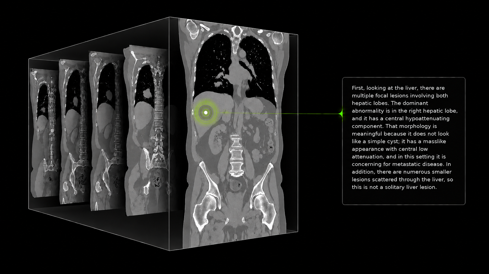

# NV-Reason-CT

NV-Reason-CT is a generative vision-language model for native 3D chest and
abdominal CT interpretation. It combines a Qwen3.5-4B language model with a 3D Vision Transformer
(Primus, initialized with COLIPRI weights) and supports abnormality classification,
structured report generation, visual question answering, and interactive
reasoning from NIfTI volumes.

This repository provides inference, supervised fine-tuning (SFT), and Group
Relative Policy Optimization (GRPO) examples for the
[NV-Reason-CT model](https://huggingface.co/nvidia/NV-Reason-CT). The complete
model package—including weights, custom model and processor code,
configuration, tokenizer, and preprocessing metadata—is maintained on Hugging
Face and is intentionally not duplicated here.

> NV-Reason-CT is for research and development only. It is not a medical
> device and must not be used as a substitute for professional clinical
> judgment, diagnosis, or treatment decisions. Model outputs can be incorrect
> and should be reviewed by qualified medical professionals.

## Contents

- [`inference.py`](inference.py): one-volume command-line inference
- [`train/vlm_sft_train.py`](train/vlm_sft_train.py): SFT example
- [`train/vlm_grpo_train.py`](train/vlm_grpo_train.py): GRPO entrypoint
- [`train/vlm_grpo_trainer.py`](train/vlm_grpo_trainer.py): 3D adaptation of the TRL GRPO trainer
- [`train/vlm_rewards.py`](train/vlm_rewards.py): region-aware verifiable rewards
- [`datalists/`](datalists): sample training records; CT volumes are not included
- [`configs/`](configs): example SFT and GRPO configurations
- [`THIRD-PARTY-NOTICES`](THIRD-PARTY-NOTICES): PyPI dependencies and the third-party package licenses

## Model source

All examples load `nvidia/NV-Reason-CT` with
`AutoModelForImageTextToText` and `AutoProcessor`. Because the model defines a
custom 3D architecture and NIfTI processor, `trust_remote_code=True` is
required. On first use, Transformers downloads the model package from Hugging
Face and stores it in the local Hugging Face cache.

The command-line inference example accepts `--model` when a local model copy or
a different Hugging Face repository is needed. The training configurations use
`model_name_or_path: nvidia/NV-Reason-CT` by default.

## Model overview

- Language backbone: [Qwen3.5-4B](https://huggingface.co/Qwen/Qwen3.5-4B)
- 3D vision encoder: Primus, initialized from COLIPRI
- Input: one-channel chest or abdominal CT in `.nii` or `.nii.gz` format
- Preprocessing: LPS orientation, 2 mm isotropic resampling, and an
  anatomy-aware `192 x 192 x 192` voxel crop
- Patch grid: `24 x 24 x 24` from non-overlapping `8 x 8 x 8` patches
- Visual interface: all 13,824 projected visual tokens are passed to the
  language model without spatial merging
- Position encoding: depth, height, and width are represented with 3D MRoPE

CT volumes are routed through the custom `images3d=` processor argument and
the Primus 3D tower.



## Installation

Python 3.11 and a CUDA-capable PyTorch installation are recommended. A fresh
environment can be created with [`uv`](https://docs.astral.sh/uv/):

```bash
uv venv --seed --python 3.11 nvreasonct
source nvreasonct/bin/activate
```

For inference:

```bash
uv pip install -r requirements.txt
```

For training:

```bash
uv pip install -r requirements-train.txt
uv pip install flash-attn==2.8.3 --no-build-isolation
```

The training code and configs are pinned to Transformers 5.6.2, TRL 1.2.0,
and Accelerate 1.13.0 because the custom GRPO trainer follows those TRL
internals.

## Quick start: inference

The input CT must contain valid Hounsfield-unit values. Select `"chest"` or
`"abdomen"` so the processor applies the corresponding deterministic crop.
Use a scan that contains the requested anatomy.

### Command-line examples

Use these prompts to generate a structured report for the selected region:

```bash
# Structured chest report
python inference.py path/to/chest.nii.gz --region chest \
  --prompt "write a structured chest CT report"

# Structured abdominal report
python inference.py path/to/abdomen.nii.gz --region abdomen \
  --prompt "write a structured abdominal CT report"
```

These are also the default prompts when `--prompt` is omitted. To request
reasoning or ask a focused question, change the prompt:

```bash
# Chest reasoning
python inference.py path/to/chest.nii.gz --region chest \
  --prompt "full chest CT reasoning analysis"

# Abdominal reasoning
python inference.py path/to/abdomen.nii.gz --region abdomen \
  --prompt "full abdominal CT reasoning analysis"

# Finding-specific question
python inference.py path/to/chest.nii.gz --region chest \
  --prompt "Which nodal regions contain lymphadenopathy?"
```

Thinking is enabled by default. For a concise response without thinking:

```bash
python inference.py path/to/chest.nii.gz --region chest \
  --prompt "Is a pleural effusion present in this CT? Answer only Yes or No." \
  --disable-thinking
```

Each CLI command loads the model and starts a new conversation. For several
questions or follow-up dialogue, reuse the model in Python as shown below.

### Reuse the model in Python

Load the model and processor once. `generate_response()` returns the generated
text; when a `history` list is supplied, it also appends the user and assistant
turns to that list.

```python
import torch
from transformers import AutoModelForImageTextToText, AutoProcessor

model_id = "nvidia/NV-Reason-CT"
chest_path = "path/to/chest.nii.gz"
abdomen_path = "path/to/abdomen.nii.gz"

model = AutoModelForImageTextToText.from_pretrained(
    model_id,
    trust_remote_code=True,
    dtype=torch.bfloat16,
    attn_implementation="sdpa",
).eval().to("cuda")
processor = AutoProcessor.from_pretrained(model_id, trust_remote_code=True)


def generate_response(
    ct_path,
    prompt_text,
    anatomy_region="chest",
    enable_thinking=True,
    max_new_tokens=2048,
    history=None,
):
    """Generate a reply and append both turns to history when provided."""
    if history is None:
        history = []
    content = [{"type": "text", "text": prompt_text}]
    if not history:
        content.insert(0, {"type": "image"})
    history.append({"role": "user", "content": content})

    prompt = processor.apply_chat_template(
        history,
        tokenize=False,
        add_generation_prompt=True,
        enable_thinking=enable_thinking,
    )
    inputs = processor(
        text=prompt,
        images3d=[ct_path],
        anatomy_region=anatomy_region,
        return_tensors="pt",
    ).to(model.device)

    with torch.inference_mode():
        output_ids = model.generate(
            **inputs,
            max_new_tokens=max_new_tokens,
            do_sample=False,
            use_cache=True,
        )

    new_tokens = output_ids[:, inputs.input_ids.shape[1]:]
    response = processor.batch_decode(
        new_tokens,
        skip_special_tokens=True,
        clean_up_tokenization_spaces=False,
    )[0]
    history.append(
        {"role": "assistant", "content": [{"type": "text", "text": response}]}
    )
    return response
```

These independent requests reuse the loaded model without sharing conversation
history:

```python
# Structured reports
print(generate_response(chest_path, "write a structured chest CT report"))
print(generate_response(abdomen_path, "write a structured abdominal CT report", anatomy_region="abdomen"))

# Full reasoning
print(generate_response(chest_path, "full chest CT reasoning analysis"))
print(generate_response(abdomen_path, "full abdominal CT reasoning analysis", anatomy_region="abdomen"))
```

### Follow-up questions

Pass the same history list to retain earlier questions and answers. The
questions below are appropriate when liver lesions are present or discussed in
the report. Adapt case-specific questions to the actual findings.

```python
history = []
print(generate_response(abdomen_path, "write a structured abdominal CT report", anatomy_region="abdomen", history=history))
print(generate_response(abdomen_path, "Are the liver lesions solitary or multiple?", anatomy_region="abdomen", history=history))
print(generate_response(abdomen_path, "What is the most likely differential for the liver lesions?", anatomy_region="abdomen", history=history))
print(generate_response(abdomen_path, "which associated findings support it?", anatomy_region="abdomen", history=history))
```

Keep the same CT path and anatomy region throughout a conversation. Start with
a new empty history list for a different scan or region. The image marker is
included only in the first user turn, while the same CT volume is supplied on
every call.

To continue an existing conversation, supply alternating `user` and `assistant`
messages in the same format. The assistant replies below are shortened examples;
replace them with the actual previous replies for your scan:

```python
history = [
    {
        "role": "user",
        "content": [
            {"type": "image"},
            {"type": "text", "text": "write a structured abdominal CT report"},
        ],
    },
    {
        "role": "assistant",
        "content": [{"type": "text", "text": "Liver: Multiple hypoattenuating lesions in both hepatic lobes."}],
    },
    {
        "role": "user",
        "content": [{"type": "text", "text": "Are the liver lesions solitary or multiple?"}],
    },
    {
        "role": "assistant",
        "content": [{"type": "text", "text": "Multiple, with a dominant lesion in the right hepatic lobe."}],
    },
]

print(generate_response(
    abdomen_path,
    "What is the most likely differential for the liver lesions?",
    anatomy_region="abdomen",
    history=history,
))
```

Here, `history` ends with the previous assistant reply. The function adds the
new user question, generates a response, and appends that response to `history`.
The image marker identifies where the CT belongs in the conversation; the
volume itself is still passed separately through `images3d=[ct_path]`.

## Inspect the model input crop

The same preprocessing used for inference can be inspected without running the
model:

```python
import nibabel as nib
import numpy as np
from transformers import AutoProcessor

processor = AutoProcessor.from_pretrained(
    "nvidia/NV-Reason-CT",
    trust_remote_code=True,
)
cropped = processor.image_processor_3d.load_image(
    "path/to/volume.nii.gz",
    normalize_mode=0,  # preserve Hounsfield units for inspection
    anatomy_region="chest",
)

affine = np.diag([-2.0, -2.0, 2.0, 1.0])
cropped_volume = cropped[0].permute(2, 1, 0).detach().cpu().numpy()
nib.save(nib.Nifti1Image(cropped_volume, affine), "crop.nii.gz")
```

The inspection file has the correct 2 mm voxel size and LPS axis directions,
but `load_image()` does not retain the source scan's world-space origin. If the
anatomy heuristic is unsuitable for a dataset, crop the volume before model
input and call the processor with `anatomy_region=None` in custom code.

## Sample training data

The two manifests contain the same 128 CT-RATE structured chest report examples
and are provided for illustrative purposes only. `datalists/sft.jsonl` includes
the assistant responses;
`datalists/grpo.jsonl` keeps the same prompts and solutions without assistant
responses (not needed for GRPO). Images are not included. Download the matching
CT volumes from [CT-RATE](https://huggingface.co/datasets/ibrahimhamamci/CT-RATE),
following its access instructions and dataset terms.

Each SFT row contains the conversation and repeats the volume path at the top
level so the same record is easy to adapt for GRPO:

```json
{
  "id": "case-001",
  "image": "dataset/case-001.nii.gz",
  "anatomy_region": "chest",
  "solution": "Atelectasis, Pleural effusion",
  "messages": [
    {
      "role": "user",
      "content": [
        {"type": "image", "image": "dataset/case-001.nii.gz"},
        {"type": "text", "text": "Write a structured chest CT report."}
      ]
    },
    {
      "role": "assistant",
      "content": [
        {"type": "text", "text": "<think>...</think>\n...\n<answer>Atelectasis, Pleural effusion</answer>"}
      ]
    }
  ]
}
```

For GRPO, `messages` contains the user turn only. `solution` is the verified,
comma-separated finding set used by the reward, and `anatomy_region` selects
the matching chest or abdominal ontology. Allowed labels are defined in
[`train/vlm_labels.py`](train/vlm_labels.py). No-finding cases must use exactly
`No Chest Finding` or `No Abdominal Finding`.

### Prepare the CT images

Run the examples from this repository's root, with the training environment
from [Installation](#installation) activated. Training resolves relative image
paths against `--image_dir`; set it to the root for the paths in your JSONL files.

Supply CT NIfTI files in Hounsfield units; the processor handles resampling,
anatomy cropping, and normalization.

For your own data, keep the same schema: SFT conversations must end with the
assistant response to learn from; GRPO examples contain the user prompt and
verified `solution` labels. The GRPO solution is used for scoring, not added to
the model's prompt.

## SFT example

The SFT collator computes loss only on the final assistant response, sends the
NIfTI volume through `images3d=`, and preserves Qwen3.5's intended multi-turn
chat behavior. By default, the language model, 3D vision encoder, and projector
are trained end to end, starting from `nvidia/NV-Reason-CT`.

On a single node with eight CUDA GPUs, launch a short eight-step run:

```bash
accelerate launch --config_file accelerate/zero2.yaml \
  train/vlm_sft_train.py \
  --config configs/sft_config.yaml \
  --dataset_path datalists/sft.jsonl \
  --image_dir /path/to/ct-volumes \
  --output_dir data/nv_reason_ct_sft_example \
  --max_steps 8 \
  --logging_steps 1
```

The [SFT configuration](configs/sft_config.yaml) uses one example per GPU and
two gradient-accumulation steps: 16 examples per optimizer step across eight
GPUs. Eight steps cover the 128-example dataset once. Remove `--max_steps` to
use the configured number of epochs. All trainable components share the
configured learning rate.

Watch the console for `loss`, `grad_norm`, and `learning_rate`. Loss should
remain finite, but it need not decrease at every step. This short run checks
the training pipeline; it is not enough to establish model quality. Metrics
are also saved in the output directory, including `trainer_state.json` and
`train_results.json`. W&B is not required (`report_to: none`).

Use `--freeze_llm`, `--freeze_visual`, or `--freeze_merger` for controlled
adaptation experiments.

## GRPO example

GRPO samples multiple responses to a prompt and learns from their relative
rewards instead of a reference assistant response. This example uses structured
reports ending with one `<answer>...</answer>` finding-label block and combines
three rewards:

```text
2.0 * abnormality-set F1
+ 0.5 * region-specific report-structure score
+ 1.0 * soft completion-length penalty
```

By default, GRPO starts independently from `nvidia/NV-Reason-CT` and trains the
language model, 3D vision encoder, and projector end to end. On the same
eight-GPU setup, run six steps, which includes the configured five warmup steps
and one step after warmup:

```bash
accelerate launch --config_file accelerate/zero2.yaml \
  train/vlm_grpo_train.py \
  --config configs/grpo_config.yaml \
  --dataset_path datalists/grpo.jsonl \
  --image_dir /path/to/ct-volumes \
  --output_dir data/nv_reason_ct_grpo_example \
  --max_steps 6
```

The [GRPO configuration](configs/grpo_config.yaml) generates 16 completions per
prompt. Keep the supplied eight-GPU batch and accumulation settings for this
example; changing them must preserve a generation batch divisible by
`num_generations`. Remove `--max_steps` to run the configured epochs.

Watch the total `reward`, individual reward metrics, and `reward_std` as well
as the loss. GRPO loss is not directly comparable to SFT loss. Groups whose
completions all receive the same reward provide no relative learning signal.
Generation makes each GRPO step slower than an SFT step, and a six-step run is
only a pipeline check. These rewards are specific to the structured-report
task; other QA tasks may need different rewards.

### Continue from an SFT checkpoint

To use the model saved by the SFT example instead of the release checkpoint,
change `--model_name_or_path` and use a separate output directory:

```bash
accelerate launch --config_file accelerate/zero2.yaml \
  train/vlm_grpo_train.py \
  --config configs/grpo_config.yaml \
  --model_name_or_path data/nv_reason_ct_sft_example \
  --dataset_path datalists/grpo.jsonl \
  --image_dir /path/to/ct-volumes \
  --output_dir data/nv_reason_ct_sft_grpo_example \
  --max_steps 6
```

The custom trainer currently uses standard Transformers generation rather
than vLLM because the 5D CT tensor and `images3d=` route require specialized
handling.

The supplied configurations are single-node training examples. Adapt them to
your own data and hardware.

## Use the trained model

Both training scripts save the final model and processor directly in
`--output_dir`. Load that directory with the same inference script:

```bash
python inference.py path/to/chest.nii.gz \
  --model data/nv_reason_ct_sft_example \
  --region chest
```

Replace the CT path with one of your scans. To try a GRPO-trained model, use
its output directory for `--model`. The same `--prompt` options shown in
[Quick start: inference](#quick-start-inference) apply. In the Python examples,
set `model_id` to the output directory to load both the model and processor,
including for multi-turn inference.

Use a new output directory for each fresh experiment. If a `checkpoint-*`
subdirectory exists, rerunning the same training command automatically resumes
from the latest one, including optimizer and scheduler state. To continue an
interrupted run, keep its original configuration and output directory. Loading
the final model via `--model_name_or_path` into a new output directory starts a
new training run instead of restoring that training state.

## Acknowledgements

NV-Reason-CT builds on
[Qwen3.5](https://huggingface.co/Qwen/Qwen3.5-4B),
[Primus](https://openreview.net/forum?id=x4vZE4PDEu),
[COLIPRI](https://arxiv.org/abs/2510.15042),
[MONAI](https://monai.io/),
[Transformers](https://github.com/huggingface/transformers), and
[TRL](https://github.com/huggingface/trl). It extends the reasoning-centered
training strategy introduced in
[NV-Reason-CXR](https://github.com/NVIDIA-Medtech/NV-Reason-CXR).

## License

This repository is released under the [OpenMDW-1.1 license](LICENSE), the same
license used by the
[Hugging Face model repository](https://huggingface.co/nvidia/NV-Reason-CT).
Third-party package licenses are
listed in [THIRD-PARTY-NOTICES](THIRD-PARTY-NOTICES).

## Citation

This repository accompanies *NV-Reason-CT: 3D Visual Language Model for CT
Analysis*. Full citation details will be added with the public paper release.